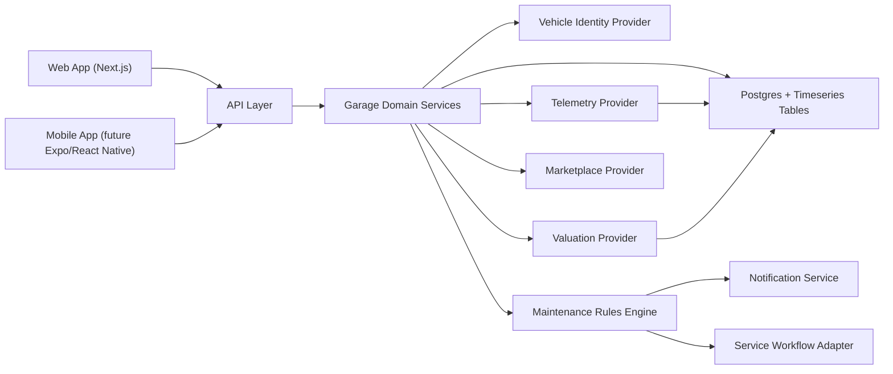

# Garage Intelligence Architecture

## Goals

Build a web and mobile product that can manage a private garage as a connected asset portfolio:

- track vehicles, specs, usage, and movement
- aggregate real-time telemetry where OEM APIs are available
- monitor market value and valuation drift over time
- maintain service schedules and alerting
- search parts and accessories across external marketplaces

## Provider strategy

The provider landscape is fragmented, so the backend should normalize several classes of integrations instead of betting on a single vendor.

### 1. Vehicle identity and specifications

- Primary baseline: `NHTSA vPIC`
- Use case: VIN decode, make/model/year/trim/body/engine normalization
- Notes: good free starting point, but not a full ownership or telemetry platform

### 2. Connected-vehicle telemetry

- Primary target: `Smartcar`
- Use case: odometer, fuel/battery, tire pressure, EV charging, location, lock status
- Design note: prefer webhook-driven ingest when supported, with scheduled refresh only as a fallback

### 3. Market value and market listings

- Primary target: `MarketCheck`
- Use case: valuation snapshots, comparable listings, regional market movement
- Design note: store every fetched valuation point so trend charts and alert thresholds can be computed internally

### 4. Maintenance intelligence

- Sources:
  - OEM maintenance schedules where available
  - mileage and age-based heuristic rules
  - owner-defined recurring tasks
- Design note: the rules engine should emit due-soon and overdue events rather than hard-coding notification behavior into task logic

### 5. Notifications

- Initial channels: email, push, SMS
- Typical providers: Resend/Postmark for email, Twilio for SMS, Expo/Firebase/APNs for push

### 6. Service appointment creation

- Constraint: there is no universal consumer-grade appointment API across repair shops and dealers
- Practical rollout:
  - Phase 1: generate a service brief and deep-link to calendar/email/phone
  - Phase 2: integrate partner-specific schedulers where a shop network exposes APIs

### 7. Parts and accessory search

- Initial targets:
  - Amazon via the Creators API direction
  - eBay Browse API
  - specialist parts vendors later
- Design note: normalize listings around fitment confidence, delivery time, price, and seller metadata

## System design

## Recommended data model

### Core entities

- `Vehicle`
- `VehicleTelemetrySnapshot`
- `VehicleValuationPoint`
- `MaintenancePlan`
- `MaintenanceTask`
- `Alert`
- `ServiceAppointment`
- `PartSearch`
- `PartListing`

### Important modeling decisions

- Treat telemetry and valuation as append-only event streams
- Store provider payload metadata for debugging and provider-switch resilience
- Keep marketplace search results separate from canonical part records
- Support manual-only vehicles as first-class records for cars without API support

## Initial release plan

### Phase 1

- Manual garage setup
- VIN decode
- Dashboard with market value, movement status, and maintenance overview
- Notifications for due and overdue maintenance
- Amazon-first parts search

### Phase 2

- Smartcar connection flow
- background sync jobs and webhook ingestion
- valuation history charting and threshold alerts
- service brief generation

### Phase 3

- mobile app
- partner-specific appointment integrations
- multi-marketplace search and fitment scoring
- insurance, registration, and document vault features
